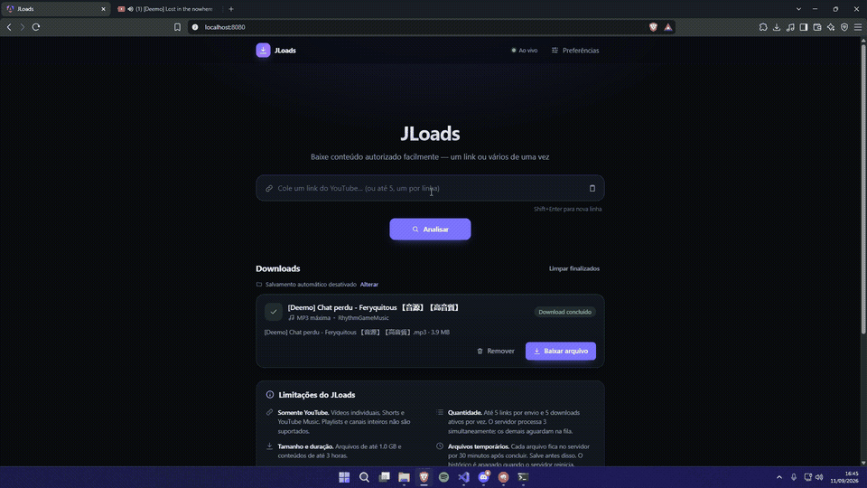
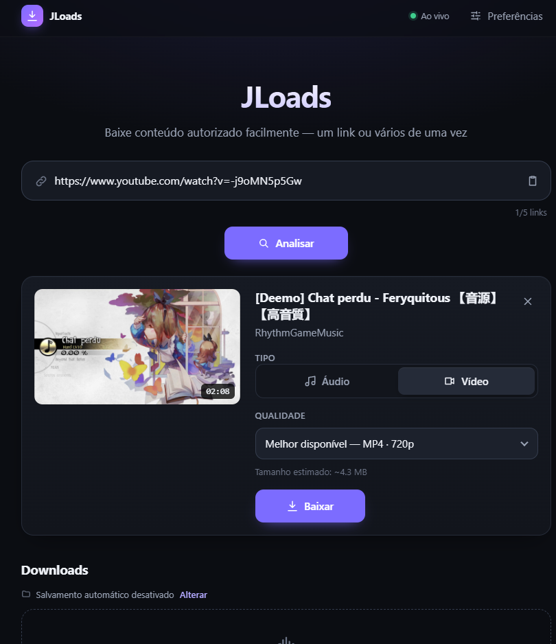
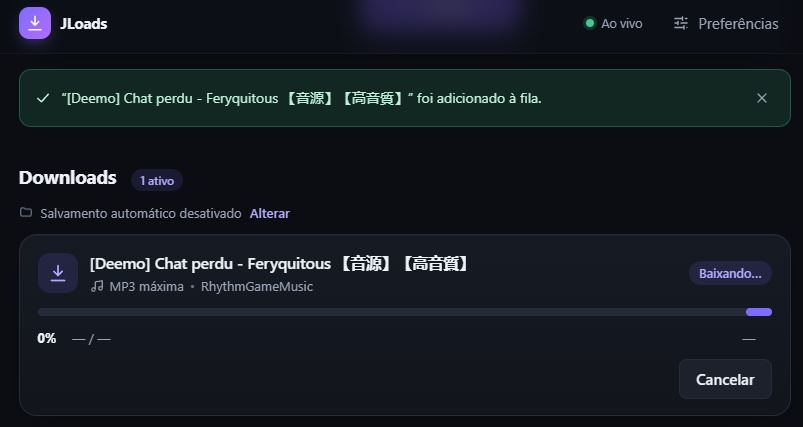
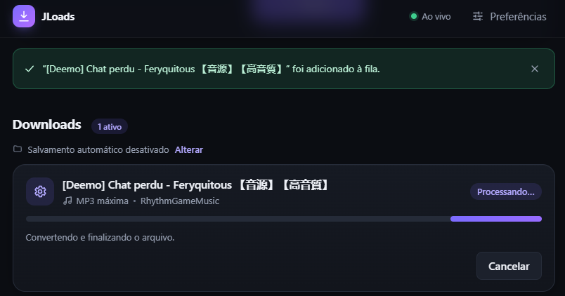
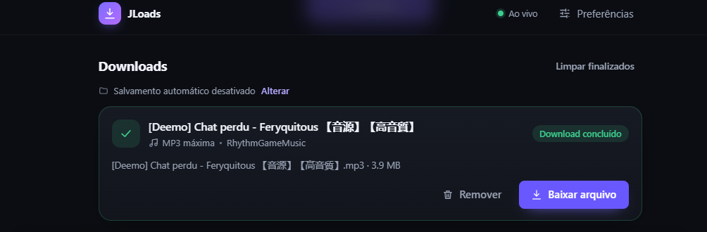

<div align="center">

# JLoads

**Baixe músicas e vídeos do YouTube no seu computador.**
Cole um ou vários links, acompanhe o progresso em tempo real e salve direto na pasta que você escolher.

[](https://github.com/jxhnlcs/JLoads/actions/workflows/ci.yml)
[](https://github.com/jxhnlcs/JLoads/releases)
[](LICENSE)



</div>

> **Uso responsável.** Baixe apenas conteúdo que você tem direito de baixar: seus próprios vídeos, conteúdo em
> domínio público, com licença que permita reutilização ou com autorização de quem criou. Os termos do YouTube
> restringem downloads. O JLoads **não** contorna DRM, login, cookies, paywalls ou verificações anti-robô, e não é
> afiliado ao YouTube ou ao Google.

## Sumário

- [O que ele faz](#o-que-ele-faz)
- [Instalação](#instalação)
  - [Opção 1 — Pacote pronto (recomendado)](#opção-1--pacote-pronto-recomendado)
  - [Instalando as dependências](#instalando-as-dependências)
  - [Opção 2 — Docker](#opção-2--docker)
  - [Opção 3 — A partir do código-fonte](#opção-3--a-partir-do-código-fonte)
- [Como usar](#como-usar)
- [Configuração](#configuração)
- [Solução de problemas](#solução-de-problemas)
- [Privacidade](#privacidade)
- [Contribuindo](#contribuindo)
- [Licença](#licença)

## O que ele faz

- **Um link:** mostra capa, título, canal e duração, e você escolhe o formato e a qualidade.
- **Vários links (até 5 por vez):** mostra miniatura e título de cada um e aplica um formato para todos.
- **Áudio em MP3** (até 320 kbps) ou **vídeo em MP4** (até a maior resolução disponível).
- **Fila de downloads** com progresso, velocidade e tempo restante ao vivo; cancelar interrompe o download de verdade.
- **Salvar automaticamente** numa pasta que você escolhe (Chrome, Edge e Opera para computador).
- **Roda no seu computador.** Não há conta, servidor de terceiros nem coleta de dados: o JLoads conversa só com o
  YouTube, como o seu navegador faria.

### Como funciona

```text
 Navegador ──▶ JLoads (Java, no seu computador) ──▶ yt-dlp ──▶ YouTube
                    │                                  │
                    │                                  └──▶ FFmpeg (converte para MP3 / junta vídeo e áudio)
                    ▼
      arquivo pronto → "Baixar arquivo" ou salvo automaticamente na sua pasta
```

O download em si é feito pelo [yt-dlp](https://github.com/yt-dlp/yt-dlp), um programa livre e muito usado. O JLoads
cuida da interface, da fila, do progresso e dos arquivos.

## Instalação

### Opção 1 — Pacote pronto (recomendado)

1. **Instale as dependências** do seu sistema ([veja abaixo](#instalando-as-dependências)).
2. **Baixe** o arquivo `jloads-X.Y.Z.zip` na página de [Releases](https://github.com/jxhnlcs/JLoads/releases) e
   extraia numa pasta.
3. **Inicie:**
   - **Windows:** dê dois cliques em `jloads.cmd`.
   - **macOS / Linux:** no terminal, dentro da pasta, rode `./jloads.sh`.
4. O navegador abre sozinho em **http://localhost:8080**. Para encerrar, feche a janela do terminal (ou `Ctrl+C`).

> O pacote contém um único `jloads-X.Y.Z.jar` com a interface embutida. Se preferir, rode direto:
> `java -jar jloads-X.Y.Z.jar` e abra http://localhost:8080.

### Instalando as dependências

| Programa | Para quê |
|---|---|
| **Java 21+** | Executa o JLoads |
| **yt-dlp** | Faz o download |
| **FFmpeg** | Converte para MP3 e junta vídeo com áudio |
| **Deno** (ou Node.js) | Runtime JavaScript que o yt-dlp precisa para o YouTube |

O JLoads encontra esses programas automaticamente no PATH. Ao iniciar, ele mostra no terminal o que encontrou e o
que está faltando.

#### Windows

Abra o **PowerShell** e rode:

```powershell
winget install EclipseAdoptium.Temurin.21.JRE
winget install yt-dlp.yt-dlp
winget install Gyan.FFmpeg
winget install DenoLand.Deno
```

Depois **feche e abra o terminal** para o PATH ser atualizado.

#### macOS

Com o [Homebrew](https://brew.sh):

```bash
brew install --cask temurin@21
brew install yt-dlp ffmpeg deno
```

#### Linux (Ubuntu/Debian)

```bash
sudo apt update
sudo apt install -y openjdk-21-jre ffmpeg python3

# yt-dlp: a versão dos repositórios costuma ser antiga; use o binário oficial
sudo curl -L https://github.com/yt-dlp/yt-dlp/releases/latest/download/yt-dlp -o /usr/local/bin/yt-dlp
sudo chmod a+rx /usr/local/bin/yt-dlp

# Deno
curl -fsSL https://deno.land/install.sh | sh
```

Se a sua distribuição não tiver o Java 21, instale o [Eclipse Temurin](https://adoptium.net).

#### Conferindo

```bash
java -version      # deve mostrar 21 ou mais
yt-dlp --version
ffmpeg -version
deno --version     # ou: node --version
```

> **Sem instalar no sistema:** crie uma pasta `bin/` ao lado do jar e coloque nela os executáveis do `yt-dlp` e do
> `ffmpeg`. O JLoads procura primeiro ali.

### Opção 2 — Docker

Não precisa instalar Java, yt-dlp nem FFmpeg — tudo vem na imagem.

```bash
git clone https://github.com/jxhnlcs/JLoads.git
cd JLoads
docker compose up --build
```

Abra **http://localhost:8081**. Os arquivos temporários ficam em `./storage`. Ajustes opcionais: copie
`.env.example` para `.env`.

### Opção 3 — A partir do código-fonte

Requisitos: as dependências acima e **Node.js 24.15+**.

```bash
git clone https://github.com/jxhnlcs/JLoads.git
cd JLoads

# Terminal 1 — backend em http://localhost:8080
cd backend
./mvnw spring-boot:run          # Windows: .\mvnw.cmd spring-boot:run

# Terminal 2 — interface em http://localhost:4200
cd frontend
npm install
npm start
```

Para gerar o pacote `.zip` igual ao da página de Releases:

```bash
sh scripts/build-release.sh 1.0.0                 # macOS / Linux
.\scripts\build-release.ps1 -Version 1.0.0        # Windows
```

O resultado fica em `dist/`.

## Como usar

1. **Cole** um link do YouTube (ou até 5, um por linha) e clique em **Analisar**.
2. **Escolha** Áudio ou Vídeo e a qualidade.
3. Clique em **Baixar**. O download entra na fila e o progresso aparece em **Downloads**.
4. Quando terminar, clique em **Baixar arquivo** — ou deixe o salvamento automático fazer isso.

| 1. Analisar o link | 2. Baixando |
|---|---|
|  |  |
| **3. Processando** | **4. Concluído** |
|  |  |

**Salvar automaticamente numa pasta:** abra **Preferências → Salvar downloads → Escolher pasta**. A partir daí,
cada download concluído é gravado nessa pasta, sem sobrescrever arquivos com o mesmo nome.

Links aceitos: `youtube.com/watch?v=…`, `youtu.be/…`, `youtube.com/shorts/…`, `music.youtube.com/watch?v=…`.
Playlists e canais inteiros não são suportados.

> Os arquivos ficam disponíveis no JLoads por **30 minutos** depois de concluídos e então são apagados da pasta
> temporária. Os que você já salvou continuam no seu computador.

## Configuração

Os valores padrão funcionam para a maioria das pessoas. Para mudar algo, use **uma** destas formas:

- **Arquivo:** copie `config/application.yml.example` para `config/application.yml` (na pasta do pacote) e edite.
- **Argumento:** `jloads.cmd --server.port=9090` ou `./jloads.sh --server.port=9090`.
- **Variável de ambiente:** `SERVER_PORT=9090 ./jloads.sh` (PowerShell: `$env:SERVER_PORT=9090; .\jloads.cmd`).

| Variável | Padrão | O que faz |
|---|---|---|
| `SERVER_PORT` | `8080` | Porta da interface |
| `SERVER_ADDRESS` | `127.0.0.1` | `0.0.0.0` libera acesso por outros aparelhos da rede (não há login) |
| `YTDLP_EXECUTABLE` | `./bin/yt-dlp` | Caminho do yt-dlp (se não existir, procura no PATH) |
| `FFMPEG_EXECUTABLE` | `./bin/ffmpeg` | Caminho do FFmpeg (se não existir, procura no PATH) |
| `YTDLP_JS_RUNTIME` | automático | `deno`, `node`, `quickjs` ou `bun` |
| `DOWNLOAD_DIRECTORY` | `./storage` | Pasta temporária dos downloads |
| `MAX_CONCURRENT_DOWNLOADS` | `3` | Downloads ao mesmo tempo |
| `MAX_BATCH_SIZE` | `5` | Links por envio |
| `MAX_FILE_SIZE` | `1GB` | Tamanho máximo por arquivo |
| `MAX_MEDIA_DURATION` | `3h` | Duração máxima do conteúdo |
| `CLEANUP_MAX_AGE` | `30` | Minutos até o arquivo concluído ser apagado |

A lista completa está em [docs/ARQUITETURA.md](docs/ARQUITETURA.md#configuração).

## Solução de problemas

<details>
<summary><b>“O yt-dlp não foi encontrado” (ou “serviço de download indisponível”)</b></summary>

O JLoads não encontrou o yt-dlp — a tela inicial e o terminal mostram o comando para instalar. No Windows:

```powershell
winget install yt-dlp.yt-dlp
```

Depois **feche e abra o JLoads** (o `jloads.cmd`). Sem instalar nada: crie uma pasta `bin` ao lado do `jloads.cmd`
e coloque o `yt-dlp.exe` dentro dela.
</details>

<details>
<summary><b>“O servidor de origem bloqueou temporariamente o acesso”</b></summary>

O YouTube pediu uma verificação anti-robô para o seu IP, normalmente depois de muitas requisições seguidas. Espere
algumas horas e tente de novo, evitando muitos downloads em sequência. O JLoads não usa cookies nem login para
contornar isso, por escolha.
</details>

<details>
<summary><b>Downloads pararam de funcionar ou dão “recusou o acesso ao formato”</b></summary>

O YouTube muda com frequência e o yt-dlp precisa acompanhar. Atualize:

```bash
yt-dlp -U                         # binário oficial
winget upgrade yt-dlp.yt-dlp      # Windows (winget)
brew upgrade yt-dlp               # macOS
```
</details>

<details>
<summary><b>MP3 falha ou aparece “Falha ao processar o arquivo baixado”</b></summary>

O FFmpeg não foi encontrado. Instale-o ([veja acima](#instalando-as-dependências)) e reinicie o JLoads — a mensagem
“FFmpeg encontrado” deve aparecer no terminal.
</details>

<details>
<summary><b>O terminal mostra “UnsupportedClassVersionError”</b></summary>

Seu Java é antigo. Instale o Java 21 ou superior. Se tiver mais de uma versão, defina `JAVA_HOME` apontando para o
Java 21 — os scripts usam ele primeiro.
</details>

<details>
<summary><b>A porta 8080 já está em uso</b></summary>

Inicie em outra porta: `jloads.cmd --server.port=9090` e abra http://localhost:9090.
</details>

<details>
<summary><b>Não aparece o botão “Escolher pasta”</b></summary>

Seu navegador não oferece esse recurso. Use Chrome, Edge ou Opera no computador. No **Brave**, ative
`brave://flags/#file-system-access-api` e reinicie o navegador. Sem ele, o salvamento automático usa a pasta de
downloads do navegador.
</details>

<details>
<summary><b>Quero usar pelo celular na mesma rede Wi-Fi</b></summary>

Inicie com `--server.address=0.0.0.0` e acesse `http://IP-DO-COMPUTADOR:8080` pelo celular. Atenção: qualquer pessoa
na mesma rede também poderá usar o seu JLoads.
</details>

## Privacidade

- Nenhuma conta, nenhuma telemetria, nenhum servidor intermediário.
- O histórico de downloads fica na memória do JLoads e some quando ele é encerrado.
- Preferências (pasta, tipo padrão) ficam salvas só no seu navegador.

## Contribuindo

O JLoads é aberto a melhorias! Abra uma [issue](https://github.com/jxhnlcs/JLoads/issues) com bugs ou ideias,
faça um fork e envie pull requests. O guia [CONTRIBUTING.md](CONTRIBUTING.md) explica como preparar o ambiente,
rodar os testes (que não acessam o YouTube) e o que é aceito no projeto.

**Feito com** Java 21 · Spring Boot 4 · Angular 22 · [yt-dlp](https://github.com/yt-dlp/yt-dlp) ·
[FFmpeg](https://ffmpeg.org). Detalhes técnicos em [docs/ARQUITETURA.md](docs/ARQUITETURA.md).

## Licença

[MIT](LICENSE) © 2026 John Lucas.

O yt-dlp e o FFmpeg são projetos independentes, com suas próprias licenças, e não são distribuídos junto com o pacote.
